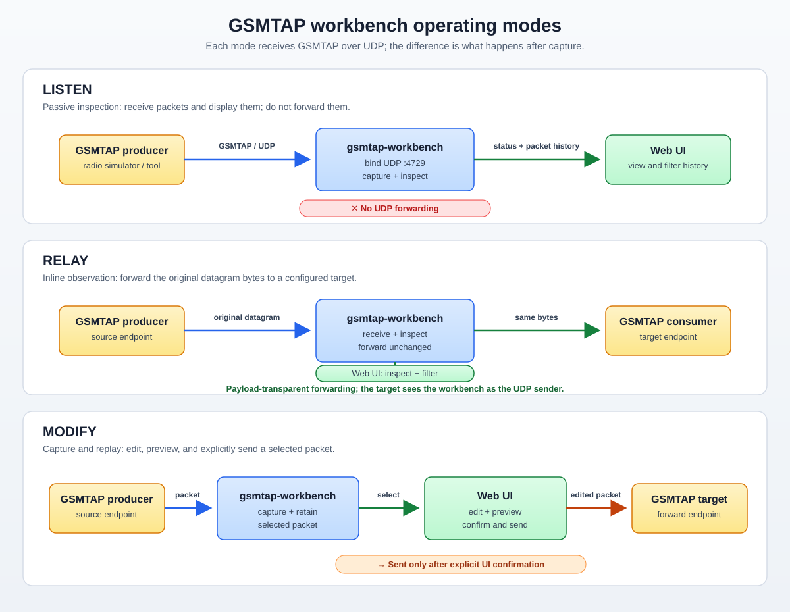
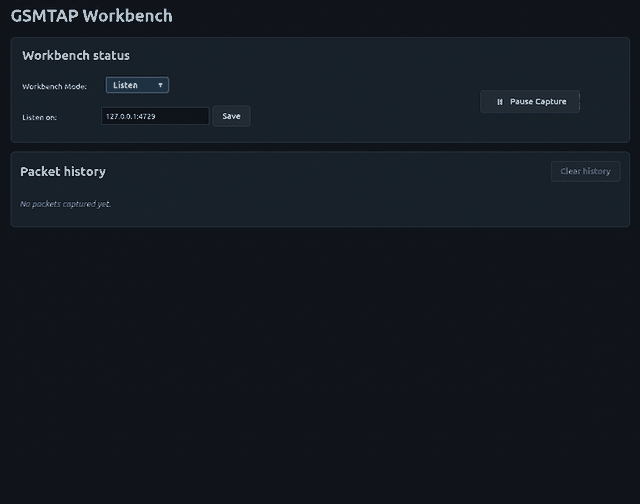
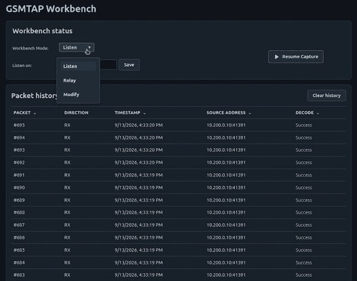

# gsmtap-rs

`gsmtap-rs` is a Rust implementation of GSMTAP packet parsing and encoding.

## Building

This project requires Rust 1.85 or newer. To build it, run:

```bash
cargo build
```

## Testing

To run tests, execute:

```bash
cargo test
```

## Live web workbench

Build and run the single-process workbench with:

```bash
cargo run --bin gsmtap-workbench
```

Open `http://localhost:8080`. Use the status card to change the GSMTAP listen
address, choose the operating mode, and set a forward target when Relay or
Modify mode is active.

### Local interactive demo

To send continuous sample traffic to an isolated local address, create the
dummy interface below, start the workbench, and run the traffic generator in a
second terminal:

```bash
sudo ip link add gsmtap-demo type dummy
sudo ip addr add 10.200.0.10/24 dev gsmtap-demo
sudo ip link set gsmtap-demo up
python3 tests/traffic/continuous.py
```

To demonstrate Relay or Modify mode with a downstream UDP service on the same
host, assign a second address before starting the demo:

```bash
sudo ip addr add 10.200.0.20/24 dev gsmtap-demo
```

Set **Listen on** to `10.200.0.10:4729` and **Forward to** to
`10.200.0.20:4729`. The downstream application must bind a UDP socket to
`10.200.0.20:4729`; relay sends selected packets there, while modify sends
explicit replays and edited packets there.

The generator sends to `10.200.0.10:4729` by default. Stop it with `Ctrl-C`,
then remove the temporary interface when finished:

```bash
sudo ip link delete gsmtap-demo
```

The container image exposes TCP port 8080 and UDP port 4729:

```bash
docker build -t gsmtap-workbench .
docker run --rm -p 8080:8080 -p 4729:4729/udp \
  gsmtap-workbench
```

The browser only calls the application API. GSMTAP parsing and encoding remain
implemented by the Rust library.

### Operating modes

The workbench has three operating modes. The web UI is available in every
mode: listen and relay provide inspection, while modify additionally provides
explicit edit, preview, and send controls.



Start the workbench once; it opens in Listen mode at `http://localhost:8080`.
Choose Relay or Modify from the **Workbench Mode** control when needed, then
enter the forward target in the UI. When using Docker, publish UDP port `4729`
as shown above.

#### Listen mode: inspect traffic

Listen mode is the default. It receives and retains packets for inspection but
never forwards them. Use it to observe a GSMTAP source safely.

Use **Pause Capture** in the status card to temporarily stop accepting incoming
datagrams; select **Resume Capture** to begin receiving them again. Existing
history remains available while capture is paused.



#### Relay mode: inspect and forward selected packets

Relay mode records incoming datagrams without automatically forwarding them.
Select one or more packets in the UI, then choose **Forward selected**. The
workbench sends the original bytes to the forward target configured in the UI;
the target sees the workbench host or container as the UDP source.


#### Modify mode: capture, edit, preview, and send

Modify mode retains incoming packets for later replay or editing. Select a
decoded received packet, change its editable fields, choose **Preview changes**,
and then choose **Confirm and send** to send the edited copy to the configured
target. Incoming traffic is never held while an operator edits a packet.


#### Change mode or listen address in the UI

The status card can change modes without restarting the application. Select
**Workbench Mode**, choose **Relay** or **Modify**, enter a `host:port` forward
target, and select the activation button. Switching back to Listen removes the
active forward target. Packet history and capture state are preserved.



The **Listen on** field changes the active GSMTAP UDP listener without a
restart. Enter an IPv4 `address:port` and select **Save**. The address must
exist on a host network interface; the HTTP listener remains configured at
startup.


For mode-by-mode use cases, see
[Mode use cases](docs/mode-use-cases.md).

The service retains only a bounded, oldest-first history (default 10,000
packets), while the UI renders a recent 500-packet page and can later select
one packet to replay or modify.
`/api/status` reports receive, parse,
ingress-drop, history-eviction, and UI-event-drop counters.

The workbench is intended for trusted lab or development traffic. It retains
packet content in memory for inspection, so do not expose it directly to
untrusted high-volume networks without applying deployment-specific bounds and
access controls.

For a local container smoke check, start the image, open
`http://localhost:8080`, and select the intended mode from the status card.
Listen mode must not forward received packets; relay mode records received
packets and forwards only the packets selected with the UI's Forward selected
action; modify mode requires using the UI's Preview changes and Confirm and
send controls. GitHub Actions runs
formatting, linting, tests, a release build, security checks, and Docker
integration checks on pushes and pull requests. Releases are created from
matching semantic-version tags such as `v0.1.0`: the crate is published to
crates.io, and the supported workbench image is published to
`ghcr.io/bucketking657/gsmtap-rs:0.1.0`. Stable releases also update the
`latest` tag; prereleases do not. GitHub Releases include the CycloneDX SBOM
and SHA256 checksums. CI also builds both container targets and runs isolated
listen, relay, and modify traffic checks.

### Reference-vector traffic checks

Build the slim Python traffic image with:

```bash
docker build --target traffic-test -t gsmtap-traffic-test .
```

It replays every committed `tests/vectors/*.json` `encoded_hex` value as
opaque bytes generated by the libosmocore reference harness. It does not
implement GSMTAP encoding. CI checks listen, byte-preserving relay (including
a malformed datagram), and modify-mode preview, replay, and explicit send.
The same checks can be run locally with Docker Compose. These automated cases
set an initial mode through `GSMTAP_MODE` so each workflow can be tested in
isolation:

```bash
GSMTAP_MODE=listen docker compose -f tests/integration/compose.yaml up --build --abort-on-container-exit --exit-code-from traffic
GSMTAP_MODE=relay docker compose -f tests/integration/compose.yaml up --build --abort-on-container-exit --exit-code-from traffic
GSMTAP_MODE=modify docker compose -f tests/integration/compose.yaml up --build --abort-on-container-exit --exit-code-from traffic
docker compose -f tests/integration/compose.yaml down --remove-orphans --volumes
```

Each invocation is an isolated Compose project with one workbench and one
traffic verifier service.
The verifier is the test assertion: it confirms receive counts through the
status/API, checks explicitly batch-forwarded relay datagrams byte-for-byte,
monitors the listen sink for unexpected forwarding, and validates modify
preview/replay/send effects.

For direct local checks, use the mode-specific scripts. For example, start the
workbench, select Relay in the status card, set its forward target to
`127.0.0.1:9000`, then run:

```bash
python3 tests/traffic/relay.py \
  --workbench-host 127.0.0.1 \
  --workbench-port 8080 \
  --listen-port 4729 \
  --sink-port 9000 \
  --vectors tests/vectors
```

`tests/traffic/listen.py` and `tests/traffic/modify.py` provide equivalent
checks for those modes. `replay.py --mode …` remains available for Compose and
automation compatibility.

## License

This project is licensed under the Apache License, Version 2.0. See
[LICENSE](LICENSE) for the full text.
